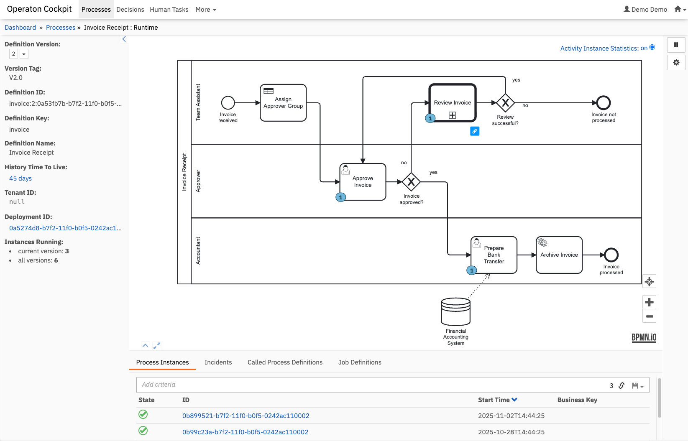

# Operaton - The open source process engine


[](https://sonarcloud.io/project/overview?id=operaton_operaton)
[](https://central.sonatype.com/search?q=org.operaton)


[](https://docs.operaton.org/)
[](https://github.com/operaton/operaton/blob/main/LICENSE)


[](https://forum.operaton.org/)
[](https://join.slack.com/t/operaton/shared_invite/zt-3kz03u9rr-NcY4NEbuptQDzJou1wyJMw)

Operaton is a native BPMN 2.0 process engine that runs inside the Java Virtual Machine. 
It can be embedded inside any Java application and any runtime container. 
It integrates with Spring, Spring Boot, Quarkus and is a perfect match for Jakarta EE. 
On top of the process engine, you can choose from a stack of tools for human workflow management, operations and monitoring.

Operaton is the successor of the Camunda 7 BPM platform that went EoL in October 2025.
Release 1.0 is feature complete and fully compatible with Camunda 7.24.


 
- Web Site: https://operaton.org/
- Getting Started: https://docs.operaton.org/docs/get-started/
- User Forum: https://forum.operaton.org/
- Issue Tracker: https://github.com/operaton/operaton/issues
- Project roadmap: https://operaton.org/roadmap
- Good First Issues: [Issue query](https://github.com/search?q=org%3Aoperaton+is%3Aopen+label%3A%22good+first+issue%22&type=issues&query=org%3Aoperaton+is%3Aopen+is%3Apr)
- Migration tool: https://github.com/operaton/migrate-from-camunda-recipe
- REST API: https://docs.operaton.org/reference/latest/rest-api/
- Javadoc API: https://docs.operaton.org/reference/latest/javadoc/
- DockerHub: https://hub.docker.com/u/operaton

## Why Operaton?

- Operaton is a reliable, extensible BPM platform for mission-critical business processes.
- Operaton is based on the battle-tested Camunda 7 code base, which has been used in production for more than a decade by thousands of companies worldwide.
- Operaton can be easily embedded inside your Java applications, giving you full control over your BPM platform.
- Operaton can also be deployed to a cloud provider or on application servers.
- Migration for Camunda 7 users is easy; Operaton 1.0 is fully compatible with Camunda 7.24.
- Operaton is a true Open Source project under the Apache License 2.0. There are no commercial editions or closed source components.
- Operaton is developed and maintained by well-known BPM experts and software engineers from multiple companies world wide.
- Professional support and consulting services are available from [multiple service providers](https://operaton.org/service-providers/).

## About Operaton

### Components

Operaton provides a rich set of components centered around the BPM lifecycle.

#### Process Implementation and Execution

- Operaton Engine - The core component responsible for executing BPMN 2.0 processes.
- REST API - The REST API provides remote access to running processes.
- Spring, CDI Integration - Programming model integration that allows developers to write Java Applications that interact with running processes.

#### Process Operations

- Operaton Engine - JMX and advanced Runtime Container Integration for process engine monitoring.
- Operaton Cockpit - Web application tool for process operations.
- Operaton Admin - Web application for managing users, groups, and their access permissions.

#### Human Task Management

- Operaton Tasklist - Web application for managing and completing user tasks in the context of processes.

### Highly Integrable

Out of the box, Operaton provides infrastructure-level integration with Java EE Application Servers and Servlet Containers.

### Embeddable

Most of the components that make up the platform can even be completely embedded inside an application. For instance, you can add the process engine and the REST API as a library to your application and assemble your custom BPM platform configuration.

### Process modelling

Operaton is fully backwards compatible to your existing BPMN-, DMN-models and Forms, which were created in Camunda Modeler for Camunda 7. You can download the Camunda Modeler [here](https://camunda.com/download/modeler/) (MIT Licence).

## Get it!

Get the latest release from the [Releases page](https://github.com/operaton/operaton/releases).

To get the latest stable build visit the [Early Access release page]([https://github.com/operaton/operaton/actions/workflows/nighly-build.yml?query=branch%3Amain+event%3Aschedule+is%3Asuccess++](https://github.com/operaton/operaton/releases/tag/early-access)), click on _Assets_ and download the desired package.

## Development

### Building

Prerequisites: JDK 17 or newer - check `java -version`

Operaton is tested and supported on Java 17, 21, and 25.

You can use the Maven Wrapper script to execute the build. The script downloads and installs (if necessary) the required Maven version to `~/.m2/wrapper` and runs it from there.

On Linux and MacOS, run
```shell
./mvnw
```

On Windows, run
```shell
mvnw
```

Alternatively, you can use your own Maven installation (minimal version: 3.9.0) Wrapper and execute
```shell
mvn
```

For a faster build you can add `-DskipTests` to skip test execution and `-Dskip.frontend.build=true` to skip the build of the webapps.

### Contributing

Please see our [contribution guidelines](CONTRIBUTING.md) for how to raise issues and how to contribute code to our project.

### Architectural Decisions

For insights into our architectural decisions and the reasoning behind them, see our [Architectural Decision Records (ADRs)](docs/decisions/). These documents provide context for key technical choices and help contributors understand the project's design principles.

### Tests

To run the tests in this repository, please see our [testing tips and tricks](TESTING.md).

## License

The source files in this repository are made available under the [Apache License Version 2.0](./LICENSE).

Operaton uses and includes third-party dependencies published under various licenses. By downloading and using Operaton artifacts, you agree to their terms and conditions. Refer to our `LICENSE_BOOK.md` in distribution archives for an overview of third-party libraries and particularly important third-party licenses we want to make you aware of.

### Security

Please see our [security policy](SECURITY.md) for how to report security vulnerabilities.

### Project documentation & reports

- [REST API](https://operaton.github.io/operaton/rest-api/index.html)
- [Javadoc API](https://operaton.github.io/javadoc/index.html)
- [Dependency Update Candidates](https://operaton.github.io/operaton/reports/dependency-updates-aggregate-report.html)
- [Maven Plugin Update Candidates](https://operaton.github.io/operaton/reports/plugin-updates-aggregate-report.html)

### Contributors

<!-- ALL-CONTRIBUTORS-LIST:START - Do not remove or modify this section -->
<!-- prettier-ignore-start -->
<!-- markdownlint-disable -->

<!-- markdownlint-restore -->
<!-- prettier-ignore-end -->

<!-- ALL-CONTRIBUTORS-LIST:END -->
