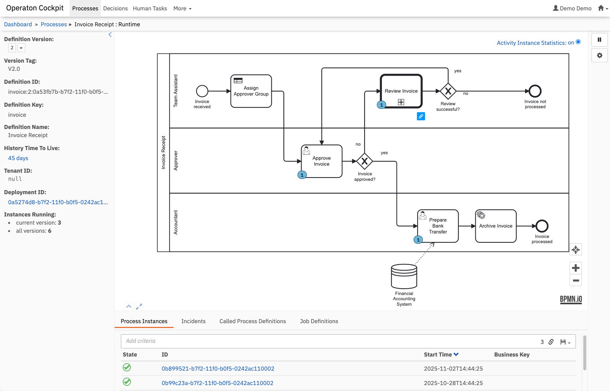

<p align="center">
  <a href="https://operaton.org">
    
  </a>
</p>

<h3 align="center">The open-source BPMN platform for mission-critical process automation</h3>

<p align="center">
  <a href="https://github.com/operaton/operaton/actions/workflows/build.yml"></a>
  <a href="https://central.sonatype.com/search?q=org.operaton"></a>
  <a href="https://github.com/operaton/operaton/blob/main/LICENSE"></a>
  <a href="https://github.com/operaton/operaton/stargazers"></a>
  <a href="https://sonarcloud.io/project/overview?id=operaton_operaton"></a>
  
</p>

<p align="center">
  <a href="https://forum.operaton.org/">Forum</a> ·
  <a href="https://join.slack.com/t/operaton/shared_invite/zt-43ugangt0-_5dsWrayqvGLMU2HYy0zJQ
  <a href="https://docs.operaton.org/">Documentation</a> ·
  <a href="https://operaton.org/roadmap">Roadmap</a>
</p>

---

Operaton is a native BPMN 2.0 process engine that runs inside the Java Virtual Machine. Born from the Camunda 7 community edition, Operaton continues to evolve and modernize the platform as a truly community-driven project.

- **Proven** — Evolved from the Camunda 7 codebase, with over a decade of production use by thousands of companies worldwide.
- **Embeddable** — Runs inside any Java application. Integrates with Spring Boot, Quarkus, and Jakarta EE.
- **Full Stack** — Process engine, REST API, and web apps (Cockpit, Tasklist, Admin) for the complete BPM lifecycle.
- **Community-Driven Open Source** — Apache License 2.0. No single-vendor control, no open-core model — built collaboratively by contributors from multiple companies.
- **Compatible** — Fully compatible REST API, database schema, and deployable models. Migrate from Camunda 7 using the OpenRewrite migration tool.
- **Extensible** — Vital ecosystem of plugins and connectors.
- **Multi-Database** — Supports H2, PostgreSQL, MySQL, MariaDB, Oracle, SQL Server, and DB2.
- **AI-Ready** — Integrate with AI assistants and LLMs via the Model Context Protocol (MCP) server.




## Why Operaton?

- Operaton is a reliable, extensible BPM platform for mission-critical business processes.
- Evolved and modernized by an active community of BPM experts and software engineers from multiple companies worldwide.
- Easily embeddable inside your Java applications, giving you full control over your BPM platform.
- Deployable on-premise, on cloud providers, or on application servers.
- Fully compatible REST API, database schema, and deployable BPMN/DMN models — migrate from Camunda 7 with ease.
- A truly community-driven Open Source project under the Apache License 2.0 — no open-core model, no commercial editions.
- Professional support and consulting services are available from [multiple service providers](https://operaton.org/service-providers/).

## ⚡ Quick Start

Run Operaton with Docker:

```shell
docker run -d --name operaton -p 8080:8080 operaton/operaton:latest
```

Then open [http://localhost:8080](http://localhost:8080) and log in with `demo` / `demo`.

➜ See the [Getting Started Guide](https://docs.operaton.org/docs/get-started/) for detailed setup instructions.

➜ See the [Examples Repository](https://github.com/operaton/operaton-examples) for numerous self-contained example projects.

### Maven

Choose your integration approach:

<details open>
<summary><b>Spring Boot</b></summary>

Add the Operaton BOM & Spring Boot Starter:

```xml
<dependencyManagement>
  <dependencies>
    <dependency>
      <groupId>org.operaton.bpm</groupId>
      <artifactId>operaton-bom</artifactId>
      <version>2.1.0</version>
      <type>pom</type>
      <scope>import</scope>
    </dependency>
  </dependencies>
</dependencyManagement>

<dependencies>
  <dependency>
    <groupId>org.operaton.bpm.springboot</groupId>
    <artifactId>operaton-bpm-spring-boot-starter</artifactId>
  </dependency>
</dependencies>
```

Then configure in `application.properties`:

```properties
operaton.bpm.database.schema-update=true
operaton.bpm.history-level=auto
```

</details>

<details>
<summary><b>Quarkus</b></summary>

Add the Operaton Quarkus Extension:

```xml
<dependencyManagement>
  <dependencies>
    <dependency>
      <groupId>org.operaton.bpm</groupId>
      <artifactId>operaton-bom</artifactId>
      <version>2.1.0</version>
      <type>pom</type>
      <scope>import</scope>
    </dependency>
  </dependencies>
</dependencyManagement>

<dependencies>
  <dependency>
    <groupId>org.operaton.bpm.quarkus</groupId>
    <artifactId>operaton-bpm-quarkus-engine</artifactId>
  </dependency>
</dependencies>
```

Configure in `application.properties`:

```properties
operaton.history.level=activity
operaton.database.schema-update=true
```

</details>

<details>
<summary><b>Embedded Engine</b></summary>

Add the core process engine only:

```xml
<dependencyManagement>
  <dependencies>
    <dependency>
      <groupId>org.operaton.bpm</groupId>
      <artifactId>operaton-bom</artifactId>
      <version>2.1.0</version>
      <type>pom</type>
      <scope>import</scope>
    </dependency>
  </dependencies>
</dependencyManagement>

<dependencies>
  <dependency>
    <groupId>org.operaton.bpm</groupId>
    <artifactId>operaton-engine</artifactId>
  </dependency>
</dependencies>
```

Then create the engine in your application:

```java
ProcessEngineConfiguration configuration = new StandaloneInMemProcessEngineConfiguration()
  .setHistory(HistoryLevel.HISTORY_LEVEL_ACTIVITY.getName())
  .setDatabaseSchemaUpdate(ProcessEngineConfiguration.DB_SCHEMA_UPDATE_TRUE);

ProcessEngine engine = configuration.buildProcessEngine();
RuntimeService runtimeService = engine.getRuntimeService();
```

</details>

Add a database driver dependency for your chosen database (e.g. H2, PostgreSQL, MySQL, Oracle, SQL Server, DB2).

Example with H2:

```xml
<dependency>
  <groupId>com.h2database</groupId>
  <artifactId>h2</artifactId>
  <scope>runtime</scope>
</dependency>
```

### Gradle

Choose your integration approach:

<details open>
<summary><b>Spring Boot</b></summary>

Add to `build.gradle`:

```gradle
dependencyManagement {
    imports {
        mavenBom 'org.operaton.bpm:operaton-bom:2.1.0'
    }
}

dependencies {
    implementation 'org.operaton.bpm.springboot:operaton-spring-boot-starter'
}
```

Configure in `application.yml` or `application.properties` (see Maven > Spring Boot section above).

</details>

<details>
<summary><b>Quarkus</b></summary>

Add to `build.gradle`:

```gradle
dependencyManagement {
    imports {
        mavenBom 'org.operaton.quarkus:operaton-quarkus-bom:2.1.0'
    }
}

dependencies {
    implementation 'org.operaton.bpm.quarkus:operaton-bpm-quarkus-engine'
}
```

Configure in `application.properties` (see Maven > Quarkus section above).

</details>

<details>
<summary><b>Embedded Engine</b></summary>

Add to `build.gradle`:

```gradle
dependencyManagement {
    imports {
        mavenBom 'org.operaton.bpm:operaton-bom:2.1.0'
    }
}

dependencies {
    implementation 'org.operaton.bpm:operaton-engine'
}
```

Then create the engine (see Maven > Embedded Engine section above) and add a database driver.

</details>

For snapshot artifacts from the development branch, add the [Sonatype Snapshots repository](https://s01.oss.sonatype.org/content/repositories/snapshots/).

## Components

### Process Implementation and Execution

- **Operaton Engine** — The core component responsible for executing BPMN 2.0 processes.
- **REST API** — Remote access to running processes.
- **Spring, CDI, Quarkus Integration** — Programming model integration for Java applications interacting with running processes.

### Process Operations

- **Operaton Cockpit** — Web application for process operations and monitoring.
- **Operaton Admin** — Web application for managing users, groups, and access permissions.

### Human Task Management

- **Operaton Tasklist** — Web application for managing and completing user tasks in the context of processes.

### Process Modeling

Operaton is fully compatible with your existing BPMN, DMN models and Forms created for Camunda 7.

## Ecosystem

| Project | Description |
|---------|-------------|
| [Web Apps](https://github.com/operaton/web-apps) | Next-generation web applications for Operaton |
| [Migration Tool](https://github.com/operaton/migrate-from-camunda-recipe) | OpenRewrite recipe to migrate from Camunda 7 |
| [Docker Images](https://github.com/operaton/operaton-docker) | Official Docker images ([DockerHub](https://hub.docker.com/u/operaton)) |
| [Helm Charts](https://github.com/operaton/operaton-helm) | Kubernetes deployment via Helm |
| [MCP Server](https://github.com/operaton/operaton-mcp) | Model Context Protocol server for AI integration |
| [Keycloak Plugin](https://github.com/operaton/operaton-keycloak) | Keycloak identity provider integration |

## Resources

- 🌐 [Website](https://operaton.org/)
- 📖 [Documentation](https://docs.operaton.org/)
- 💡 [Frequently Asked Questions](https://operaton.org/faq/)
- 🗺️ [Roadmap](https://operaton.org/roadmap)
- 💬 [Forum](https://forum.operaton.org/)
- 📡 [Slack](https://join.slack.com/t/operaton/shared_invite/zt-43ugangt0-_5dsWrayqvGLMU2HYy0zJQ)
- 🐛 [Issue Tracker](https://github.com/operaton/operaton/issues)
- 🏁 [Good First Issues](https://github.com/search?q=org%3Aoperaton+is%3Aopen+label%3A%22good+first+issue%22&type=issues)
- 📘 [REST API Reference](https://docs.operaton.org/reference/latest/rest-api/)
- 📂 [Examples](https://github.com/operaton/operaton-examples)
- 📗 [Javadoc](https://docs.operaton.org/reference/latest/javadoc/)

## Development

Prerequisites: **JDK 17 or newer** (tested on 17, 21, 25)

```shell
./mvnw clean install
```

For a faster build, skip tests and frontend:

```shell
./mvnw clean install -DskipTests -Dskip.frontend.build=true
```

See [CONTRIBUTING.md](CONTRIBUTING.md) for contribution guidelines, [TESTING.md](TESTING.md) for testing tips, and [Architectural Decision Records](docs/decisions/) for design context.

## License

The source files in this repository are made available under the [Apache License Version 2.0](./LICENSE).

Operaton uses and includes third-party dependencies published under various licenses. By downloading and using Operaton artifacts, you agree to their terms and conditions. Refer to `LICENSE_BOOK.md` in distribution archives for an overview of third-party libraries and particularly important third-party licenses we want to make you aware of.

## Security

Please see our [security policy](SECURITY.md) for how to report security vulnerabilities.
