# Architectural Decision Records (ADRs) for Operaton

This folder contains Architectural Decision Records (ADRs) for the Operaton project. ADRs document important architectural decisions, their context, and their consequences. They help ensure transparency, consistency, and long-term traceability.

We use the [MADR format](https://adr.github.io/madr/) for writing ADRs.

## Table of Contents

- [When to Write an ADR](#when-to-write-an-adr)
- [How to Create a New ADR](#how-to-create-a-new-adr)
- [File Naming Convention](#file-naming-convention)
- [ADR Status Lifecycle](#adr-status-lifecycle)
- [Style and Tone](#style-and-tone)
- [Links and References](#links-and-references)
- [Diagram Support](#diagram-support)
- [Folder Structure](#folder-structure)
- [Issue Linking and Implementation Tracking](#issue-linking-and-implementation-tracking)
- [Appendix A: What Constitutes a Significant Architectural Change?](#appendix-a-what-constitutes-a-significant-architectural-change)
- [Appendix B: How to Review an ADR](#appendix-b-how-to-review-an-adr)
- [Appendix C: ADR Creation Workflow](#appendix-c-adr-creation-workflow)
- [References](#references)

## When to Write an ADR

Create an ADR when you are:

- Proposing a significant architectural change (see [Appendix A](#appendix-a-what-constitutes-a-significant-architectural-change) for detailed criteria)
- Making a decision that will impact multiple contributors or components
- Removing or replacing core dependencies or services
- Introducing new patterns or major technical approaches

Common examples include:

- Changes to supported databases or core dependencies
- Alterations to BPMN/DMN execution logic or APIs
- Modifications to process engine architecture or data models
- Introduction of breaking changes

## How to Create a New ADR

The ADR creation process offers two starting options, both leading to the same review and approval workflow. For a visual overview of the complete process, see [Appendix C: ADR Creation Workflow](#appendix-c-adr-creation-workflow).

### ADR Metadata Format

All ADRs should include metadata at the top using this YAML format:

```yaml
---
status: Proposed
date: 2025-07-16
decision-makers: [@alice, @bob]
consulted: [@carol]
informed: [@dave]
---
```

### Option 1: Start with a GitHub Issue

1. Create or identify a GitHub issue: If no relevant issue exists, create a new GitHub issue to track the ADR discussion and decision-making process. If an existing issue covers the topic, you can use that issue instead. This provides a central place for initial discussion and helps maintain traceability.

2. Follow the steps in [Create the ADR File](#create-the-adr-file).

### Option 2: Start Directly with a Draft Pull Request

1. Follow the steps in [Create the ADR File](#create-the-adr-file).

2. Submit a draft Pull Request with your ADR immediately to start the discussion.

### Create the ADR File {#create-the-adr-file}

1. Copy `adr-template.md` and rename it to the next available number and a short title, for example:

   `cp adr-template.md 0003-replace-event-bus.md`

2. Edit the new file and fill in the sections with your proposal, context, considered alternatives, and decision.

3. **Important**: In the metadata section at the top of the ADR, use GitHub IDs (e.g., `@username`) to identify:
    - `decision-makers`: Everyone involved in making the decision
    - `consulted`: Subject-matter experts whose opinions were sought
    - `informed`: People who are kept up-to-date on progress

   This ensures clear accountability and traceability of who was involved in the decision-making process. Use individual GitHub usernames rather than generic team aliases (e.g., `@johndoe` instead of `@team-backend`) for better accountability.

### Common Steps for Both Approaches

1. Submit a draft Pull Request with your ADR (if not done already). Use the PR to discuss and refine the proposal with others. If you started with an issue, reference it in your PR description.

2. **Consensus and approval**: All listed `decision-makers` must approve the ADR Pull Request. Consensus is reached when:
    - All decision-makers have reviewed and approved the PR
    - Any concerns raised during review have been addressed
    - The ADR accurately reflects the agreed-upon decision

   If consensus cannot be reached through normal PR review:
    - Escalate to a community call for broader discussion
    - As a last resort, maintainers may call for a formal vote (requiring 2/3 majority)

3. Once consensus is reached and all decision-makers have approved, the PR can be merged. The ADR is then considered accepted.

### Important Notes for Contributors

- **Early discussion encouraged**: ADR proposals should focus on the decision and rationale rather than requiring full implementation upfront. This encourages early discussion and consensus before significant investment in implementation work.
- **Branch preference**: For contributors with repository access, prefer creating branches in the main repository rather than long-lived merge requests from forks, as this facilitates easier collaboration and review.
- **Release integration**: ADRs and their current status become formal release artifacts, providing a historical record of architectural decisions at each release.

## File Naming Convention

- Use a 4-digit prefix followed by a short kebab-case title
- If multiple ADRs are in flight, rebase and renumber as needed to maintain sequential order

Examples:

- `0001-drop-mariadb-support.md`
- `0010-new-api-auth.md`
- `0123-unify-logging.md`

## ADR Status Lifecycle

ADRs can have different statuses that indicate their current state:

| Status | Meaning |
|------------|--------------------------------------------------------|
| Proposed | Under discussion; not yet approved |
| Accepted | Decision finalized and agreed upon |
| Rejected | Considered but not adopted |
| Superseded | Replaced by a newer ADR (include reference) |
| Deprecated | No longer relevant or applicable |

Status changes are made by updating the `status` field in the ADR's metadata section. When superseding an ADR, update both the old ADR (mark as superseded) and reference it in the new one.

## Style and Tone

ADRs are formal documentation that may be referenced years later. Write clearly and professionally.

### Writing Guidelines

Well-written ADRs help teams understand and revisit decisions years later. When creating your ADR:

**✅ Do:**

- Use simple, clear language. Assume future readers have no current context.
- Document the problem first, then the decision.
- Describe trade-offs and rejected alternatives honestly.
- Include meaningful consequences (both positive and negative).
- State who was involved (`decision-makers`, `consulted`, `informed`).
- Keep each ADR focused — one decision per file.
- Write in a clear, professional, and generally understandable tone.
- Avoid internal shorthand, abbreviations, or casual phrasing.
- Keep ADRs concise and focused. Aim for clarity over comprehensiveness.

**❌ Don't:**

- Avoid vague statements like "industry standard" without justification.
- Don't overcomplicate with excessive detail or jargon.
- Avoid putting implementation details in the decision section.
- Avoid creating ADRs after implementation solely to justify a pre-made decision.

### Context for Readers

Assume the reader may not be part of current discussions but needs to understand the rationale years later. Long ADRs are harder to review and maintain, so focus on the essential information that will remain relevant over time.

For detailed guidance, see the [References](#references) section.

## Links and References

When linking to external resources in ADRs:

- Use absolute URLs for links targeting URLs outside the decisions directory
- For GitHub issues, use the full URL (e.g., `https://github.com/operaton/operaton/issues/847`) instead of relative references (don't use simply `#847`).

This ensures links remain functional when ADRs are viewed outside the repository context or in different formats

## Diagram Support

You can use [Mermaid diagrams](https://mermaid.js.org/) in ADRs. GitHub supports rendering them directly in Markdown. See [GitHub's Mermaid documentation](https://docs.github.com/en/get-started/writing-on-github/working-with-advanced-formatting/creating-diagrams) for details.

## Folder Structure

- `docs/decisions/`: All ADR files
- `docs/decisions/adr-template.md`: The MADR template
- `docs/decisions/assets/`: Optional images or diagrams

## Issue Linking and Implementation Tracking

To maintain clear traceability between ADRs and their implementation, consider one of the following approaches:

### Commit Alongside Implementation

Include the ADR in the same commit/PR as the code changes that implement it. This creates a direct link between the decision documentation and its implementation.

### Create Implementation Issues

Create separate GitHub issues for implementing the ADR (if applicable). Reference the ADR in these issues and link back to the implementation issues in the ADR itself. This approach is useful for larger changes that require multiple implementation phases.

### ADR Created During Implementation

When an ADR is created as part of an existing implementation issue to discuss and decide on architectural aspects, reference the original implementation issue in the ADR. This maintains the connection between the implementation work and the architectural decision that emerged during development.

## Appendix A: What Constitutes a Significant Architectural Change?

A change is considered significant if it:

- Affects the overall system structure or component interactions
- Introduces or removes major dependencies (databases, frameworks, libraries)
- Changes core APIs or interfaces used by multiple components
- Modifies data flow, security models, or deployment patterns
- Has long-term implications that are difficult to reverse
- Requires coordination across multiple teams or components
- Affects performance, scalability, or operational characteristics significantly
- Introduces breaking changes to existing APIs, interfaces, or behavior
- Impacts BPMN/DMN execution behavior or compatibility
- Changes process engine core functionality or lifecycle management
- Affects database schema or persistence layer architecture
- Modifies job execution, task handling, or event processing mechanisms

### Examples of Significant Changes

- Changes to the number of supported databases (e.g., dropping support for MariaDB)
- Introducing a new communication protocol or message format
- Altering BPMN/DMN parsing, validation, or execution logic
- Changes to process instance lifecycle or state management
- Updates to REST API endpoints that affect client compatibility
- Changes to database migration strategy or schema evolution

### Examples of Changes That Typically Don't Need an ADR

- Bug fixes or small feature additions that don't change behavior
- Fixing SonarQube issues or code quality improvements
- Refactoring that doesn't change public interfaces
- Updating versions of existing dependencies (unless breaking changes)
- Local optimizations that don't affect other components
- Minor UI/UX improvements in webapps
- Documentation updates or test improvements

## Appendix B: How to Review an ADR

Reviewing ADRs is not about personal taste — it's about improving the clarity, completeness, and relevance of architectural decisions. Keep the following best practices in mind:

### ✅ Do

- Ask clarifying questions to improve context and rationale.
- Challenge assumptions with constructive, project-relevant objections.
- Ensure all decision drivers and considered options are clearly documented.
- Check that consequences (both good and bad) are realistic and complete.
- Verify traceability (linked issues, status, stakeholders).
- Offer alternative suggestions only when they are grounded in objective reasoning.

### ❌ Don't

- Reject decisions based on personal preferences without justification.
- Accept vague reasons like "everyone uses it" or "sounds cool" without data.
- Focus on superficial formatting if clarity and structure are sufficient.
- Use non-technical arguments (e.g., "I don't like it" or "We never did it this way").

For detailed guidance, see the [References](#references) section.

## Appendix C: ADR Creation Workflow

```mermaid
flowchart TD
    A[Start ADR Creation] --> B{Choose Approach}
    
    B -->|Option 1| C[Create/Identify GitHub Issue]
    B -->|Option 2| D[Start Directly with Draft PR]
    
    C --> E[Create the ADR File]
    D --> E
    
    E --> F[Copy adr-template.md]
    F --> G[Rename to next number + title<br/>e.g., 0003-replace-event-bus.md]
    G --> H[Add YAML metadata:<br/>• status: Proposed<br/>• decision-makers<br/>• consulted<br/>• informed]
    
    H --> I[Fill in ADR sections:<br/>• Context<br/>• Decision<br/>• Alternatives<br/>• Consequences]
    
    I --> J{Already have PR?}
    J -->|No| K[Create Draft Pull Request]
    J -->|Yes| L[Update existing PR]
    
    K --> M[Discussion & Review]
    L --> M
    
    M --> N{Consensus Reached?}
    N -->|No| O{Need Escalation?}
    N -->|Yes| P[Approval Reached]
    
    O -->|Yes| Q[Community Call]
    O -->|No| M
    
    Q --> R{Consensus Reached?}
    R -->|No| S[Maintainer Vote<br/>2/3 majority required]
    R -->|Yes| P
    
    S --> T{Vote Passes?}
    T -->|Yes| P
    T -->|No| U[ADR Rejected]
    
    P --> V[Merge PR]
    V --> W[ADR Accepted ✅]
    
    style A fill:#4CAF50,stroke:#2E7D32,stroke-width:3px,color:#fff
    style W fill:#00C853,stroke:#00A040,stroke-width:3px,color:#fff
    style U fill:#F44336,stroke:#C62828,stroke-width:3px,color:#fff
    style Q fill:#FF9800,stroke:#F57C00,stroke-width:3px,color:#fff
    style S fill:#9C27B0,stroke:#6A1B9A,stroke-width:3px,color:#fff
    style B fill:#2196F3,stroke:#1565C0,stroke-width:2px,color:#fff
    style N fill:#2196F3,stroke:#1565C0,stroke-width:2px,color:#fff
    style O fill:#2196F3,stroke:#1565C0,stroke-width:2px,color:#fff
    style R fill:#2196F3,stroke:#1565C0,stroke-width:2px,color:#fff
    style T fill:#2196F3,stroke:#1565C0,stroke-width:2px,color:#fff
    style J fill:#2196F3,stroke:#1565C0,stroke-width:2px,color:#fff
    style P fill:#4CAF50,stroke:#2E7D32,stroke-width:2px,color:#fff
    style V fill:#4CAF50,stroke:#2E7D32,stroke-width:2px,color:#fff
    style E fill:#E3F2FD,stroke:#1976D2,stroke-width:2px,color:#000
```



## References

📖 *MADR (Markdown Architectural Decision Records)*  
<https://adr.github.io/madr/>

📖 *GitHub's Mermaid documentation*  
<https://docs.github.com/en/get-started/writing-on-github/working-with-advanced-formatting/creating-diagrams>

📖 *How to create Architectural Decision Records (ADRs) — and how not to*  
<https://www.ozimmer.ch/practices/2023/04/03/ADRCreation.html>

📖 *How to review Architectural Decision Records (ADRs) — and how not to*  
<https://www.ozimmer.ch/practices/2023/04/05/ADRReview.html>
