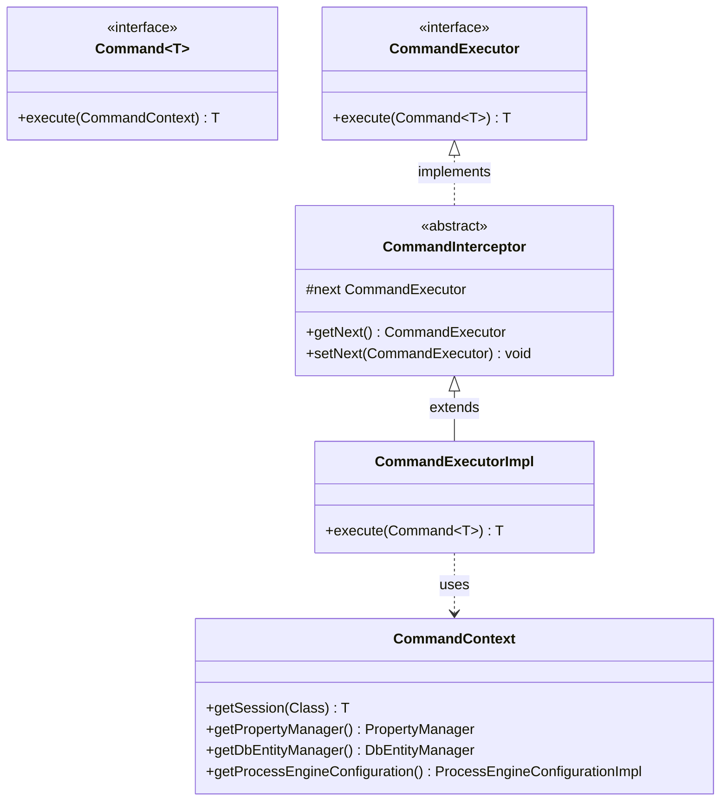
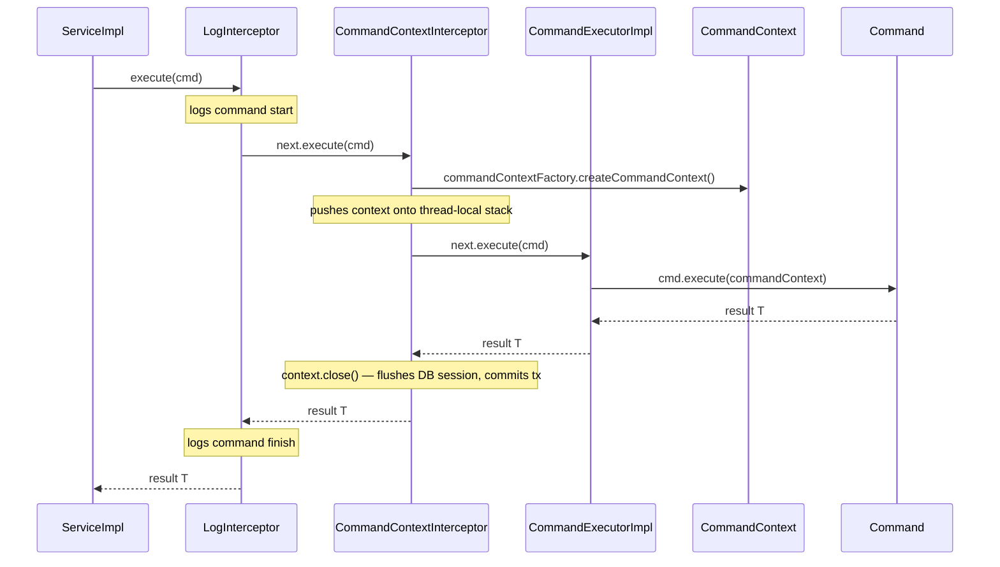
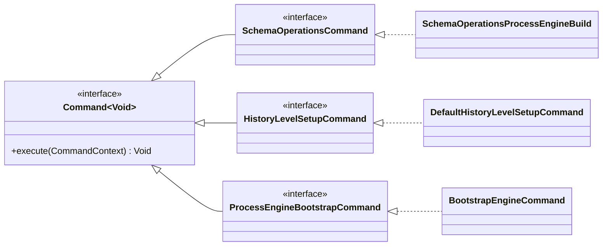

# Command Pattern in the Operaton Engine

## Introduction

The Operaton engine uses the **Command** design pattern as the foundation for every engine
operation — from starting a process instance to deleting a job. Each operation is encapsulated
in a `Command` object: a unit of work that carries its own parameters, executes against a
`CommandContext`, and returns a typed result.

This approach brings three key benefits:

- **Transactional consistency**: every command runs inside a transaction managed by the
  interceptor chain
- **Cross-cutting concerns without coupling**: logging, authorization checks, and context
  management are applied uniformly via interceptors without the command knowing about them
- **Plugin extensibility**: the engine startup lifecycle exposes command interfaces that plugins
  can replace

## Core Components



| Type | Package | Role |
|------|---------|------|
| `Command<T>` | `org.operaton.bpm.engine.impl.interceptor` | Single-method interface: the operation to execute |
| `CommandExecutor` | `org.operaton.bpm.engine.impl.interceptor` | Entry point for executing commands |
| `CommandInterceptor` | `org.operaton.bpm.engine.impl.interceptor` | Abstract base for chain members; each holds a `next` reference |
| `CommandExecutorImpl` | `org.operaton.bpm.engine.impl.interceptor` | Terminal element: invokes the command with the active context |
| `CommandContext` | `org.operaton.bpm.engine.impl.interceptor` | Holds sessions, transaction, and configuration for the current command |

## The Interceptor Chain

All commands are executed through a configured chain of `CommandInterceptor` instances. The
default chain for standalone configurations is:

```
LogInterceptor → CommandContextInterceptor → CommandExecutorImpl
```



Each `CommandInterceptor` delegates to its `next` executor, forming a chain of responsibility.
`CommandContextInterceptor` is the most important: it either opens a new `CommandContext` or
reuses the active one (for nested commands), and always closes the context after the outermost
command completes.

JTA-based configurations (Spring, Quarkus, WildFly) insert a transaction interceptor before
`CommandContextInterceptor`, linking the context lifecycle to the JTA transaction.

### Context Reuse

Commands dispatched from within a running command (delegation code, listeners, service tasks)
reuse the existing `CommandContext`. The context is pushed to a thread-local stack; the depth
of the stack indicates whether execution is inside a nested command.

## Service Layer Delegation

The public API services (`RuntimeService`, `TaskService`, `HistoryService`, etc.) are
implemented as thin façades. Each service holds a reference to a `CommandExecutor` and
delegates every method call to a dedicated `Command` class:

```java
// in TaskServiceImpl
@Override
public void deleteTask(String taskId) {
    commandExecutor.execute(new DeleteTaskCmd(taskId, null, false));
}
```

Commands live in `org.operaton.bpm.engine.impl.cmd` and follow a consistent pattern:

- Constructor accepts all parameters needed for the operation
- `execute(CommandContext)` performs the work using the context's sessions and managers
- Complex operations may compose sub-commands (e.g., `DefaultHistoryLevelSetupCommand`
  internally invokes `DetermineHistoryLevelCmd`)

## The CommandContext

`CommandContext` is the single gateway to the engine's runtime resources inside a command.

| Accessor | Returns | Purpose |
|----------|---------|---------|
| `getSession(Class<T>)` | `T` | Generic session lookup (e.g., `DbEntityManager`, `PersistenceSession`) |
| `getPropertyManager()` | `PropertyManager` | Read/write the `ACT_GE_PROPERTY` table |
| `getDbEntityManager()` | `DbEntityManager` | Low-level entity CRUD |
| `getProcessEngineConfiguration()` | `ProcessEngineConfigurationImpl` | Full engine configuration |
| `getTransactionContext()` | `TransactionContext` | Enlist work in the current transaction |
| `getAuthorizationManager()` | `AuthorizationManager` | Check permissions |

Commands should not create their own database sessions or transactions; they always go through
`CommandContext`.

## Engine Lifecycle Commands

Three special commands run once during engine startup, executed by `ProcessEngineImpl` via the
`commandExecutorSchemaOperations` executor in this order:

1. `schemaOperationsCommand` — schema ready
2. `historyLevelCommand` — history level persisted
3. `bootstrapCommand` — application-level bootstrap



| Interface | Package | Default Implementation | Responsibility |
|-----------|---------|----------------------|---------------|
| `SchemaOperationsCommand` | `org.operaton.bpm.engine` | `SchemaOperationsProcessEngineBuild` | Create, update, validate, or drop the database schema |
| `HistoryLevelSetupCommand` | `org.operaton.bpm.engine.impl` | `DefaultHistoryLevelSetupCommand` | Verify or initialize the history level property in the database |
| `ProcessEngineBootstrapCommand` | `org.operaton.bpm.engine` | `BootstrapEngineCommand` | Initialize installation ID, create history cleanup job |

All three interfaces are configured on `ProcessEngineConfiguration` with getter/setter pairs,
making them the primary extension point for engine plugins.

## Customizing Commands in Plugins

All three lifecycle command fields in `ProcessEngineConfiguration` are mutable. A
`ProcessEnginePlugin` can replace any of them in `preInit`:

```java
public class MyHistoryPlugin extends AbstractProcessEnginePlugin {

    @Override
    public void preInit(ProcessEngineConfigurationImpl configuration) {
        configuration.setHistoryLevelCommand(new MyHistoryLevelSetupCommand());
    }
}

public class MyHistoryLevelSetupCommand implements HistoryLevelSetupCommand {

    @Override
    public Void execute(CommandContext commandContext) {
        // custom history level logic
        return null;
    }
}
```

The same pattern applies to `SchemaOperationsCommand` and `ProcessEngineBootstrapCommand`.
