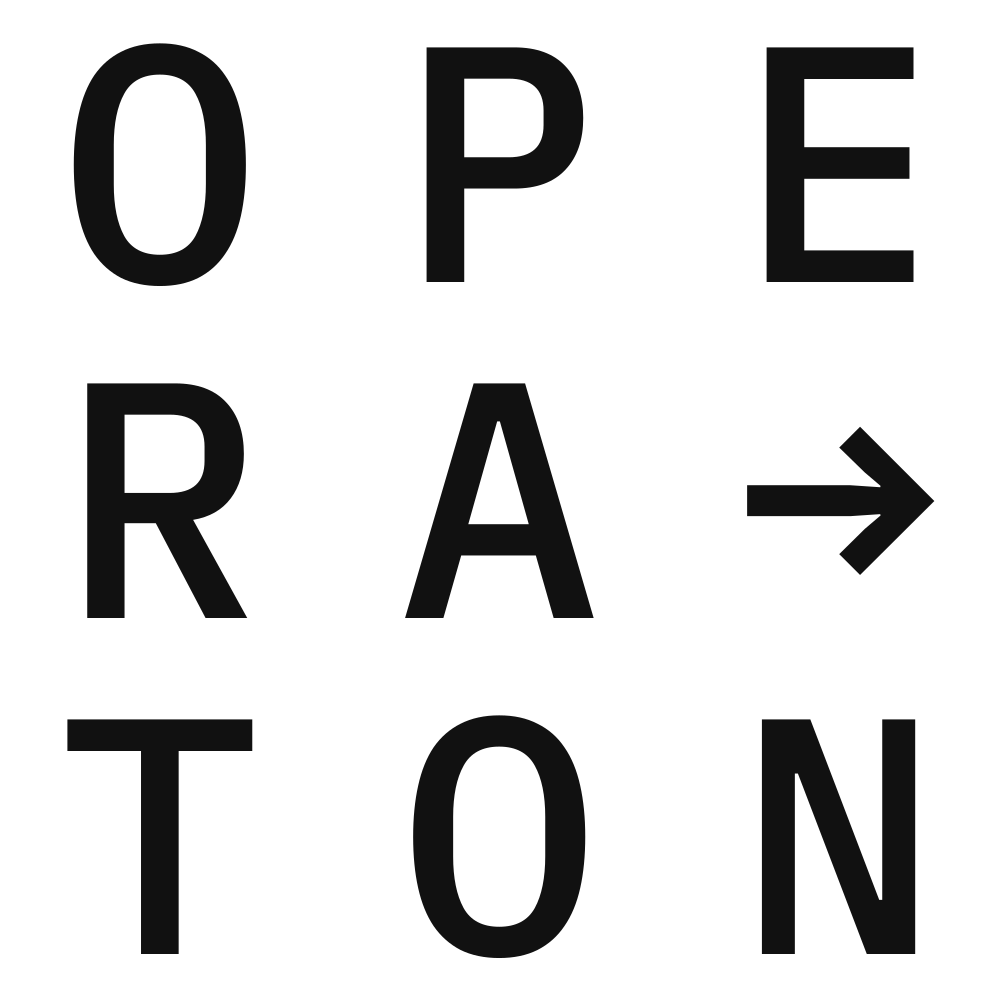

# Barrierefreiheitsbericht — Operaton Web Apps

<!-- GENERIERTE DATEI — nicht bearbeiten. Neu erzeugen mit `npm run a11y:report`. -->

Nur zur Information: Dieser Bericht lässt niemals einen Build fehlschlagen.

## Inhalt

- [Scan-Umgebung](#scan-umgebung)
- [Zusammenfassung](#zusammenfassung)
- [Manuelle Prüfung erforderlich](#manuelle-prüfung-erforderlich)
- [Seiten](#seiten)
- [Komponenten von Drittanbietern](#komponenten-von-drittanbietern)

## Scan-Umgebung

| Einstellung | Wert |
| --- | --- |
| Erstellt | 2026-08-18 07:43 UTC |
| Commit | `38826c864f` |
| Regelsatz | WCAG 2.0 / 2.1 / 2.2 Stufe A + AA, zzgl. axe Best Practice |
| axe-core-Tags | `wcag2a` `wcag2aa` `wcag21a` `wcag21aa` `wcag22aa` `best-practice` |
| Aktive Regeln | 100 axe-Regeln (inkl. `target-size`, standardmäßig deaktiviert) |
| Engines | axe-core 4.12.1 · pa11y 9.1.1 (HTML_CodeSniffer, WCAG2AA) |
| Globale Achse | hell / dunkel × Desktop 1440×900 / Mobil 390×844 |
| Seiten | 16 |
| Scans | 78 axe · 16 pa11y |
| Backend | Operaton 1.0.3 |
| Datenstand | über dev-fixtures befüllt (Deployment + feste Instanzzahlen, kein Last-Bot) |
| Sprache | en-US |

Der Anfragezustand `LOADING` wird bewusst nicht geprüft: Einen
flüchtigen Zustand zu erfassen ist zeitkritisch und würde diesen Bericht bei
jedem Lauf verändern. Das `<html lang="en">` des Dokuments ist statisch
(`index.html`); eine nicht-englische Darstellung ist daher ein echter Verstoß
gegen WCAG 3.1.1, den **keine der hier eingesetzten Engines erkennen kann**.

## Zusammenfassung

| Seite | Route | Kritisch | Schwerwiegend | Mittel | Gering | Zustände | Schlechtester Zustand |
| --- | --- | --- | --- | --- | --- | --- | --- |
| Dashboard | `/` | 0 | 0 | 0 | 0 | 4 | — |
| Aufgaben | `/tasks` | 2 | 5 | 8 | 0 | 10 | Globale Suche (Dialog geöffnet) · hell · Desktop |
| Prozess starten | `/tasks/start` | 0 | 0 | 4 | 0 | 4 | Standard · hell · Desktop |
| Prozesse | `/processes` | 0 | 0 | 0 | 0 | 6 | — |
| Entscheidungen | `/decisions` | 0 | 0 | 5 | 0 | 5 | Standard · hell · Desktop |
| Deployments | `/deployments` | 0 | 0 | 0 | 0 | 6 | — |
| Batches | `/batches` | 0 | 2 | 0 | 0 | 5 | Standard · hell · Mobil |
| Migrationen | `/migrations` | 0 | 0 | 0 | 0 | 4 | — |
| Konto | `/account` | 0 | 0 | 4 | 0 | 4 | Standard · hell · Desktop |
| Administration | `/admin` | 0 | 0 | 4 | 0 | 4 | Standard · hell · Desktop |
| Hilfe | `/help` | 0 | 4 | 0 | 0 | 4 | Standard · hell · Desktop |
| Nicht gefunden (404) | `/does-not-exist` | 0 | 0 | 0 | 0 | 4 | — |
| Anmeldung (nicht authentifiziert) | `/` | 0 | 0 | 12 | 0 | 6 | Standard · hell · Desktop |
| Prozessinstanz-Detail | `/processes/{definitionId}/instances/{id}/vars` | 0 | 2 | 4 | 0 | 4 | Standard · dunkel · Desktop |
| Aufgaben-Detail | `/tasks/{id}` | 0 | 2 | 4 | 0 | 4 | Standard · dunkel · Desktop |
| Entscheidungs-Detail | `/decisions/{definitionId}` | 0 | 2 | 6 | 4 | 4 | Standard · hell · Mobil |
| **Gesamt** |  | **2** | **17** | **51** | **4** | **78** |  |

### Nach Regel

| Regel | Auswirkung | Seiten | WCAG | Engines | Referenz |
| --- | --- | --- | --- | --- | --- |
| `aria-required-children` | kritisch | 1 | 1.3.1 | axe | [Behebung](https://dequeuniversity.com/rules/axe/4.12/aria-required-children?application=playwright) |
| `color-contrast` | schwerwiegend | 3 | 1.4.3 | axe | [Behebung](https://dequeuniversity.com/rules/axe/4.12/color-contrast?application=playwright) |
| `scrollable-region-focusable` | schwerwiegend | 2 | 2.1.1, 2.1.3 | axe | [Behebung](https://dequeuniversity.com/rules/axe/4.12/scrollable-region-focusable?application=playwright) |
| `target-size` | schwerwiegend | 2 | 2.5.8 | axe | [Behebung](https://dequeuniversity.com/rules/axe/4.12/target-size?application=playwright) |
| `landmark-banner-is-top-level` | mittel | 1 | — | axe | [Behebung](https://dequeuniversity.com/rules/axe/4.12/landmark-banner-is-top-level?application=playwright) |
| `landmark-one-main` | mittel | 1 | — | axe | [Behebung](https://dequeuniversity.com/rules/axe/4.12/landmark-one-main?application=playwright) |
| `landmark-unique` | mittel | 1 | — | axe | [Behebung](https://dequeuniversity.com/rules/axe/4.12/landmark-unique?application=playwright) |
| `page-has-heading-one` | mittel | 8 | — | axe | [Behebung](https://dequeuniversity.com/rules/axe/4.12/page-has-heading-one?application=playwright) |
| `region` | mittel | 1 | — | axe | [Behebung](https://dequeuniversity.com/rules/axe/4.12/region?application=playwright) |
| `empty-table-header` | gering | 1 | — | axe | [Behebung](https://dequeuniversity.com/rules/axe/4.12/empty-table-header?application=playwright) |

## Manuelle Prüfung erforderlich

axe konnte diese nicht automatisch entscheiden — meist, weil eine Farbe hinter
einem Bild oder Verlauf nicht auslesbar ist. Jeder Punkt muss von einer Person
bestätigt oder verworfen werden.

| Regel | Seiten | Zu prüfen |
| --- | --- | --- |
| `color-contrast` | 7 | Elements must meet minimum color contrast ratio thresholds |
| `th-has-data-cells` | 5 | Table headers in a data table must refer to data cells |

## Seiten

### Dashboard — `/`

| Zustand | Kritisch | Schwerwiegend | Mittel | Gering | Hinweis |
| --- | --- | --- | --- | --- | --- |
| Standard · hell · Desktop | 0 | 0 | 0 | 0 |  |
| Standard · hell · Mobil | 0 | 0 | 0 | 0 |  |
| Standard · dunkel · Desktop | 0 | 0 | 0 | 0 |  |
| Standard · dunkel · Mobil | 0 | 0 | 0 | 0 |  |

_Keine Verstöße in einem geprüften Zustand._

### Aufgaben — `/tasks`

| Zustand | Kritisch | Schwerwiegend | Mittel | Gering | Hinweis |
| --- | --- | --- | --- | --- | --- |
| Standard · hell · Desktop | 0 | 0 | 1 | 0 |  |
| Standard · hell · Mobil | 0 | 0 | 1 | 0 |  |
| Standard · dunkel · Desktop | 0 | 1 | 1 | 0 |  |
| Standard · dunkel · Mobil | 0 | 1 | 1 | 0 |  |
| Globale Suche (Dialog geöffnet) · hell · Desktop | 1 | 0 | 1 | 0 |  |
| Globale Suche (Dialog geöffnet) · dunkel · Desktop | 1 | 0 | 1 | 0 |  |
| Mobile Navigation (Dialog geöffnet) · hell · Mobil | 0 | 1 | 0 | 0 |  |
| Mobile Navigation (Dialog geöffnet) · dunkel · Mobil | 0 | 2 | 0 | 0 |  |
| Leere Ergebnismenge · hell · Desktop | 0 | 0 | 1 | 0 |  |
| Backend-Fehler (RequestState ERROR) · hell · Desktop | 0 | 0 | 1 | 0 |  |

#### `aria-required-children` — kritisch

Certain ARIA roles must contain particular children · WCAG 1.3.1 · [Behebung](https://dequeuniversity.com/rules/axe/4.12/aria-required-children?application=playwright)

- Zustände: `Globale Suche (Dialog geöffnet) · dunkel · Desktop`, `Globale Suche (Dialog geöffnet) · hell · Desktop`
- Fundstellen:
  - `#goto-listbox`
- Beispiel: `

Type to search across all resources, or …`

#### `color-contrast` — schwerwiegend

Elements must meet minimum color contrast ratio thresholds · WCAG 1.4.3 · [Behebung](https://dequeuniversity.com/rules/axe/4.12/color-contrast?application=playwright)

- Zustände: `Mobile Navigation (Dialog geöffnet) · dunkel · Mobil`, `Standard · dunkel · Desktop`, `Standard · dunkel · Mobil`
- Fundstellen:
  - `.button`
  - `nav[aria-label="Mobile navigation"] > menu:nth-child(n) > li:nth-child(n) > a[href$="tasks"][aria-current="page"]`
- Beispiel: `<a href="/tasks/start" class="button start-process">Start Process</a>`

#### `target-size` — schwerwiegend

All touch targets must be 24px large, or leave sufficient space · WCAG 2.5.8 · [Behebung](https://dequeuniversity.com/rules/axe/4.12/target-size?application=playwright)

- Zustände: `Mobile Navigation (Dialog geöffnet) · dunkel · Mobil`, `Mobile Navigation (Dialog geöffnet) · hell · Mobil`
- Fundstellen:
  - `#mobile-logout`
- Beispiel: `<button type="button" id="mobile-logout">Logout</button>`

#### `landmark-banner-is-top-level` — mittel

Banner landmark should not be contained in another landmark · [Behebung](https://dequeuniversity.com/rules/axe/4.12/landmark-banner-is-top-level?application=playwright)

- Zustände: `Globale Suche (Dialog geöffnet) · dunkel · Desktop`, `Globale Suche (Dialog geöffnet) · hell · Desktop`
- Fundstellen:
  - `search > header`
- Beispiel: `<header><h2>Go To</h2><button class="neutral">Close</button></header>`

#### `page-has-heading-one` — mittel

Page should contain a level-one heading · [Behebung](https://dequeuniversity.com/rules/axe/4.12/page-has-heading-one?application=playwright)

- Zustände: `Backend-Fehler (RequestState ERROR) · hell · Desktop`, `Leere Ergebnismenge · hell · Desktop`, `Standard · dunkel · Desktop`, `Standard · dunkel · Mobil`, `Standard · hell · Desktop`, `Standard · hell · Mobil`
- Fundstellen:
  - `html`
- Beispiel: `<html lang="en">`

### Prozess starten — `/tasks/start`

| Zustand | Kritisch | Schwerwiegend | Mittel | Gering | Hinweis |
| --- | --- | --- | --- | --- | --- |
| Standard · hell · Desktop | 0 | 0 | 1 | 0 |  |
| Standard · hell · Mobil | 0 | 0 | 1 | 0 |  |
| Standard · dunkel · Desktop | 0 | 0 | 1 | 0 |  |
| Standard · dunkel · Mobil | 0 | 0 | 1 | 0 |  |

#### `page-has-heading-one` — mittel

Page should contain a level-one heading · [Behebung](https://dequeuniversity.com/rules/axe/4.12/page-has-heading-one?application=playwright)

- Zustände: `Standard · dunkel · Desktop`, `Standard · dunkel · Mobil`, `Standard · hell · Desktop`, `Standard · hell · Mobil`
- Fundstellen:
  - `html`
- Beispiel: `<html lang="en">`

### Prozesse — `/processes`

| Zustand | Kritisch | Schwerwiegend | Mittel | Gering | Hinweis |
| --- | --- | --- | --- | --- | --- |
| Standard · hell · Desktop | 0 | 0 | 0 | 0 |  |
| Standard · hell · Mobil | 0 | 0 | 0 | 0 |  |
| Standard · dunkel · Desktop | 0 | 0 | 0 | 0 |  |
| Standard · dunkel · Mobil | 0 | 0 | 0 | 0 |  |
| Leere Ergebnismenge · hell · Desktop | 0 | 0 | 0 | 0 |  |
| Backend-Fehler (RequestState ERROR) · hell · Desktop | 0 | 0 | 0 | 0 |  |

_Keine Verstöße in einem geprüften Zustand._

### Entscheidungen — `/decisions`

| Zustand | Kritisch | Schwerwiegend | Mittel | Gering | Hinweis |
| --- | --- | --- | --- | --- | --- |
| Standard · hell · Desktop | 0 | 0 | 1 | 0 |  |
| Standard · hell · Mobil | 0 | 0 | 1 | 0 |  |
| Standard · dunkel · Desktop | 0 | 0 | 1 | 0 |  |
| Standard · dunkel · Mobil | 0 | 0 | 1 | 0 |  |
| Leere Ergebnismenge · hell · Desktop | 0 | 0 | 1 | 0 |  |

#### `page-has-heading-one` — mittel

Page should contain a level-one heading · [Behebung](https://dequeuniversity.com/rules/axe/4.12/page-has-heading-one?application=playwright)

- Zustände: `Leere Ergebnismenge · hell · Desktop`, `Standard · dunkel · Desktop`, `Standard · dunkel · Mobil`, `Standard · hell · Desktop`, `Standard · hell · Mobil`
- Fundstellen:
  - `html`
- Beispiel: `<html lang="en">`

### Deployments — `/deployments`

| Zustand | Kritisch | Schwerwiegend | Mittel | Gering | Hinweis |
| --- | --- | --- | --- | --- | --- |
| Standard · hell · Desktop | 0 | 0 | 0 | 0 |  |
| Standard · hell · Mobil | 0 | 0 | 0 | 0 |  |
| Standard · dunkel · Desktop | 0 | 0 | 0 | 0 |  |
| Standard · dunkel · Mobil | 0 | 0 | 0 | 0 |  |
| Deployment-Upload (Dialog geöffnet) · hell · Desktop | 0 | 0 | 0 | 0 |  |
| Leere Ergebnismenge · hell · Desktop | 0 | 0 | 0 | 0 |  |

_Keine Verstöße in einem geprüften Zustand._

### Batches — `/batches`

| Zustand | Kritisch | Schwerwiegend | Mittel | Gering | Hinweis |
| --- | --- | --- | --- | --- | --- |
| Standard · hell · Desktop | 0 | 0 | 0 | 0 |  |
| Standard · hell · Mobil | 0 | 1 | 0 | 0 |  |
| Standard · dunkel · Desktop | 0 | 0 | 0 | 0 |  |
| Standard · dunkel · Mobil | 0 | 1 | 0 | 0 |  |
| Leere Ergebnismenge · hell · Desktop | 0 | 0 | 0 | 0 |  |

#### `scrollable-region-focusable` — schwerwiegend

Scrollable region must have keyboard access · WCAG 2.1.1, 2.1.3 · [Behebung](https://dequeuniversity.com/rules/axe/4.12/scrollable-region-focusable?application=playwright)

- Zustände: `Standard · dunkel · Mobil`, `Standard · hell · Mobil`
- Fundstellen:
  - `.batch-empty`
- Beispiel: `
Select a batch to show its details.
`

### Migrationen — `/migrations`

| Zustand | Kritisch | Schwerwiegend | Mittel | Gering | Hinweis |
| --- | --- | --- | --- | --- | --- |
| Standard · hell · Desktop | 0 | 0 | 0 | 0 |  |
| Standard · hell · Mobil | 0 | 0 | 0 | 0 |  |
| Standard · dunkel · Desktop | 0 | 0 | 0 | 0 |  |
| Standard · dunkel · Mobil | 0 | 0 | 0 | 0 |  |

_Keine Verstöße in einem geprüften Zustand._

### Konto — `/account`

| Zustand | Kritisch | Schwerwiegend | Mittel | Gering | Hinweis |
| --- | --- | --- | --- | --- | --- |
| Standard · hell · Desktop | 0 | 0 | 1 | 0 |  |
| Standard · hell · Mobil | 0 | 0 | 1 | 0 |  |
| Standard · dunkel · Desktop | 0 | 0 | 1 | 0 |  |
| Standard · dunkel · Mobil | 0 | 0 | 1 | 0 |  |

#### `page-has-heading-one` — mittel

Page should contain a level-one heading · [Behebung](https://dequeuniversity.com/rules/axe/4.12/page-has-heading-one?application=playwright)

- Zustände: `Standard · dunkel · Desktop`, `Standard · dunkel · Mobil`, `Standard · hell · Desktop`, `Standard · hell · Mobil`
- Fundstellen:
  - `html`
- Beispiel: `<html lang="en">`

### Administration — `/admin`

| Zustand | Kritisch | Schwerwiegend | Mittel | Gering | Hinweis |
| --- | --- | --- | --- | --- | --- |
| Standard · hell · Desktop | 0 | 0 | 1 | 0 |  |
| Standard · hell · Mobil | 0 | 0 | 1 | 0 |  |
| Standard · dunkel · Desktop | 0 | 0 | 1 | 0 |  |
| Standard · dunkel · Mobil | 0 | 0 | 1 | 0 |  |

#### `page-has-heading-one` — mittel

Page should contain a level-one heading · [Behebung](https://dequeuniversity.com/rules/axe/4.12/page-has-heading-one?application=playwright)

- Zustände: `Standard · dunkel · Desktop`, `Standard · dunkel · Mobil`, `Standard · hell · Desktop`, `Standard · hell · Mobil`
- Fundstellen:
  - `html`
- Beispiel: `<html lang="en">`

### Hilfe — `/help`

| Zustand | Kritisch | Schwerwiegend | Mittel | Gering | Hinweis |
| --- | --- | --- | --- | --- | --- |
| Standard · hell · Desktop | 0 | 1 | 0 | 0 |  |
| Standard · hell · Mobil | 0 | 1 | 0 | 0 |  |
| Standard · dunkel · Desktop | 0 | 1 | 0 | 0 |  |
| Standard · dunkel · Mobil | 0 | 1 | 0 | 0 |  |

#### `target-size` — schwerwiegend

All touch targets must be 24px large, or leave sufficient space · WCAG 2.5.8 · [Behebung](https://dequeuniversity.com/rules/axe/4.12/target-size?application=playwright)

- Zustände: `Standard · dunkel · Desktop`, `Standard · dunkel · Mobil`, `Standard · hell · Desktop`, `Standard · hell · Mobil`
- Fundstellen:
  - `ul:nth-child(n) > li:nth-child(n) > a`
  - `ul:nth-child(n) > li:nth-child(n) > a[href$="forum.operaton.org"]`
  - `ul:nth-child(n) > li:nth-child(n) > a[href$="help"]`
- Beispiel: `<a href="/help">Help Page</a>`

### Nicht gefunden (404) — `/does-not-exist`

| Zustand | Kritisch | Schwerwiegend | Mittel | Gering | Hinweis |
| --- | --- | --- | --- | --- | --- |
| Standard · hell · Desktop | 0 | 0 | 0 | 0 |  |
| Standard · hell · Mobil | 0 | 0 | 0 | 0 |  |
| Standard · dunkel · Desktop | 0 | 0 | 0 | 0 |  |
| Standard · dunkel · Mobil | 0 | 0 | 0 | 0 |  |

_Keine Verstöße in einem geprüften Zustand._

### Anmeldung (nicht authentifiziert) — `/`

| Zustand | Kritisch | Schwerwiegend | Mittel | Gering | Hinweis |
| --- | --- | --- | --- | --- | --- |
| Standard · hell · Desktop | 0 | 0 | 2 | 0 |  |
| Standard · hell · Mobil | 0 | 0 | 2 | 0 |  |
| Standard · dunkel · Desktop | 0 | 0 | 2 | 0 |  |
| Standard · dunkel · Mobil | 0 | 0 | 2 | 0 |  |
| SSO-Anmeldung (OAuth2-Modus) · hell · Desktop | 0 | 0 | 2 | 0 |  |
| SSO-Anmeldung (OAuth2-Modus) · dunkel · Desktop | 0 | 0 | 2 | 0 |  |

#### `landmark-one-main` — mittel

Document should have one main landmark · [Behebung](https://dequeuniversity.com/rules/axe/4.12/landmark-one-main?application=playwright)

- Zustände: `SSO-Anmeldung (OAuth2-Modus) · dunkel · Desktop`, `SSO-Anmeldung (OAuth2-Modus) · hell · Desktop`, `Standard · dunkel · Desktop`, `Standard · dunkel · Mobil`, `Standard · hell · Desktop`, `Standard · hell · Mobil`
- Fundstellen:
  - `html`
- Beispiel: `<html lang="en">`

#### `region` — mittel

All page content should be contained by landmarks · [Behebung](https://dequeuniversity.com/rules/axe/4.12/region?application=playwright)

- Zustände: `SSO-Anmeldung (OAuth2-Modus) · dunkel · Desktop`, `SSO-Anmeldung (OAuth2-Modus) · hell · Desktop`, `Standard · dunkel · Desktop`, `Standard · dunkel · Mobil`, `Standard · hell · Desktop`, `Standard · hell · Mobil`
- Fundstellen:
  - `#password`
  - `#username`
  - `.login-language`
  - `h1`
  - `img`
  - `label`
  - `label[for="password"]`
  - `label[for="username"]`
  - `span`
- Beispiel: ``

### Prozessinstanz-Detail — `/processes/{definitionId}/instances/{id}/vars`

| Zustand | Kritisch | Schwerwiegend | Mittel | Gering | Hinweis |
| --- | --- | --- | --- | --- | --- |
| Standard · hell · Desktop | 0 | 0 | 1 | 0 |  |
| Standard · hell · Mobil | 0 | 0 | 1 | 0 |  |
| Standard · dunkel · Desktop | 0 | 1 | 1 | 0 |  |
| Standard · dunkel · Mobil | 0 | 1 | 1 | 0 |  |

#### `color-contrast` — schwerwiegend

Elements must meet minimum color contrast ratio thresholds · WCAG 1.4.3 · [Behebung](https://dequeuniversity.com/rules/axe/4.12/color-contrast?application=playwright)

- Zustände: `Standard · dunkel · Desktop`, `Standard · dunkel · Mobil`
- Fundstellen:
  - `.selected-instance > .button-group > .danger[type="button"]`
- Beispiel: `<button type="button" class="danger">Cancel</button>`

#### `page-has-heading-one` — mittel

Page should contain a level-one heading · [Behebung](https://dequeuniversity.com/rules/axe/4.12/page-has-heading-one?application=playwright)

- Zustände: `Standard · dunkel · Desktop`, `Standard · dunkel · Mobil`, `Standard · hell · Desktop`, `Standard · hell · Mobil`
- Fundstellen:
  - `html`
- Beispiel: `<html lang="en">`

### Aufgaben-Detail — `/tasks/{id}`

| Zustand | Kritisch | Schwerwiegend | Mittel | Gering | Hinweis |
| --- | --- | --- | --- | --- | --- |
| Standard · hell · Desktop | 0 | 0 | 1 | 0 |  |
| Standard · hell · Mobil | 0 | 0 | 1 | 0 |  |
| Standard · dunkel · Desktop | 0 | 1 | 1 | 0 |  |
| Standard · dunkel · Mobil | 0 | 1 | 1 | 0 |  |

#### `color-contrast` — schwerwiegend

Elements must meet minimum color contrast ratio thresholds · WCAG 1.4.3 · [Behebung](https://dequeuniversity.com/rules/axe/4.12/color-contrast?application=playwright)

- Zustände: `Standard · dunkel · Desktop`, `Standard · dunkel · Mobil`
- Fundstellen:
  - `.button`
- Beispiel: `<a href="/tasks/start" class="button start-process">Start Process</a>`

#### `page-has-heading-one` — mittel

Page should contain a level-one heading · [Behebung](https://dequeuniversity.com/rules/axe/4.12/page-has-heading-one?application=playwright)

- Zustände: `Standard · dunkel · Desktop`, `Standard · dunkel · Mobil`, `Standard · hell · Desktop`, `Standard · hell · Mobil`
- Fundstellen:
  - `html`
- Beispiel: `<html lang="en">`

### Entscheidungs-Detail — `/decisions/{definitionId}`

| Zustand | Kritisch | Schwerwiegend | Mittel | Gering | Hinweis |
| --- | --- | --- | --- | --- | --- |
| Standard · hell · Desktop | 0 | 0 | 2 | 1 |  |
| Standard · hell · Mobil | 0 | 1 | 1 | 1 |  |
| Standard · dunkel · Desktop | 0 | 0 | 2 | 1 |  |
| Standard · dunkel · Mobil | 0 | 1 | 1 | 1 |  |

#### `scrollable-region-focusable` — schwerwiegend

Scrollable region must have keyboard access · WCAG 2.1.1, 2.1.3 · [Behebung](https://dequeuniversity.com/rules/axe/4.12/scrollable-region-focusable?application=playwright)

- Zustände: `Standard · dunkel · Mobil`, `Standard · hell · Mobil`
- Fundstellen:
  - `.tjs-table-container`
- Beispiel: `
`

#### `landmark-unique` — mittel

Landmarks should have a unique role or role/label/title (i.e. accessible name) combination · [Behebung](https://dequeuniversity.com/rules/axe/4.12/landmark-unique?application=playwright)

- Zustände: `Standard · dunkel · Desktop`, `Standard · hell · Desktop`
- Fundstellen:
  - `#secondary-navigation`
- Beispiel: `<nav id="secondary-navigation"><menu><li><a href="/help">Help</a></li><li><a href="/account">Account</a></li></menu></na…`

#### `page-has-heading-one` — mittel

Page should contain a level-one heading · [Behebung](https://dequeuniversity.com/rules/axe/4.12/page-has-heading-one?application=playwright)

- Zustände: `Standard · dunkel · Desktop`, `Standard · dunkel · Mobil`, `Standard · hell · Desktop`, `Standard · hell · Mobil`
- Fundstellen:
  - `html`
- Beispiel: `<html lang="en">`

#### `empty-table-header` — gering

Table header text should not be empty · [Behebung](https://dequeuniversity.com/rules/axe/4.12/empty-table-header?application=playwright)

- Zustände: `Standard · dunkel · Desktop`, `Standard · dunkel · Mobil`, `Standard · hell · Desktop`, `Standard · hell · Mobil`
- Fundstellen:
  - `.index-column`
- Beispiel: `<th class="index-column"></th>`

## Komponenten von Drittanbietern

Die Prozess- und Entscheidungsansichten binden **[bpmn-js](https://github.com/bpmn-io/bpmn-js)**,
**dmn-js** und **@bpmn-io/form-js** von [bpmn.io](https://bpmn.io) ein. Diese stellen
Diagramme als **SVG-Canvas** dar, was für Screenreader standardmäßig nicht
zugänglich ist — Screenreader vermitteln Text, keine Grafiken.

- bpmn-js weist **keine WCAG-Konformitätsstufe** aus, und die README enthält
  keinen Abschnitt zur Barrierefreiheit.
- Es gibt eine frühe Upstream-Initiative,
  [`@bpmn-io/a11y`](https://github.com/bpmn-io/a11y) — *"Minimal tool to achieve
  bpmn.io accessibility goals"* (MIT, v0.1.0, bislang wenig Aktivität).
- diagram-js, worauf bpmn-js aufbaut, hat seit bpmn-js 3.0.0 Verbesserungen bei
  der Tastaturnavigation erhalten; Kontextmenü und Popup-Menü sind per Tastatur
  erreichbar.

Jede Diagrammfläche in diesem Bericht gilt als **für Screenreader-Nutzende nicht
zugänglich**, solange es keine Textalternative von Upstream gibt. Befunde zu
diesen Teilbäumen sind eine Untergrenze, keine Obergrenze: axe kann die
umgebenden Bedienelemente prüfen, aber nicht feststellen, dass ein
BPMN-Diagramm ohne Sehvermögen unbenutzbar ist.
